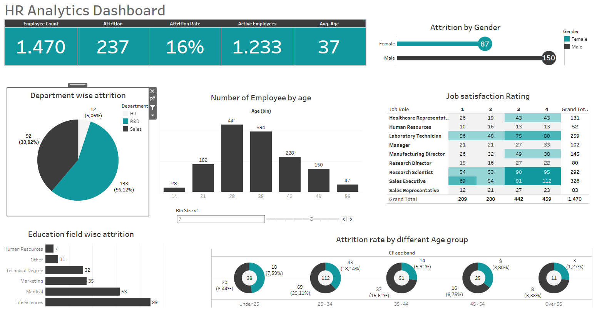

# Tableau-Project--Project-HR-Analytics

This project is an interactive HR analytics dashboard built with Tableau, designed to provide insights into employee demographics, attrition patterns, and job satisfaction. The dashboard allows users to dynamically explore workforce data by filtering across various dimensions such as department, gender, education, and age groups.

# Features:

Employee Overview: High-level KPIs including employee count, attrition numbers, attrition rate, active employees, and average age.

Department-wise Attrition: Breakdown of attrition across HR, R&D, and Sales departments.

Gender Analysis: Comparison of attrition between male and female employees.

Age Distribution: Histogram showing the number of employees across different age groups.

Education Field Analysis: Attrition rates across different education fields such as Life Sciences, Medical, Technical, and more.

Job Satisfaction Rating: Matrix visualization of satisfaction levels across different job roles.

Attrition by Age Group: Donut charts highlighting attrition rates for employees under 25, 25–34, 35–44, 45–54, and over 55.

# Key Visualizations:

KPI Cards: Employee count, attrition rate, and average age.

Pie Chart: Department-wise attrition.

Bar Chart: Age distribution and education field attrition.

Heatmap Table: Job satisfaction by role.

Donut Charts: Attrition rates by age group.

Gender Comparison: Attrition split between male and female employees.

# Screenshots:

